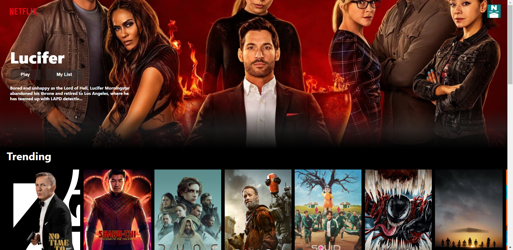
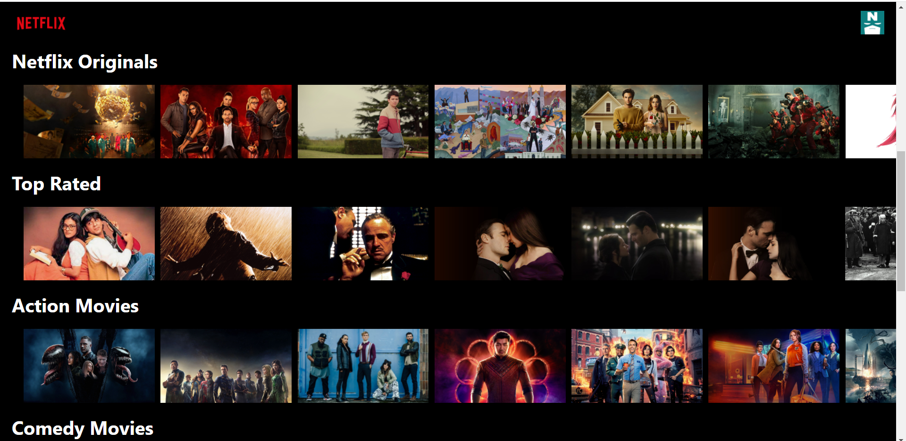
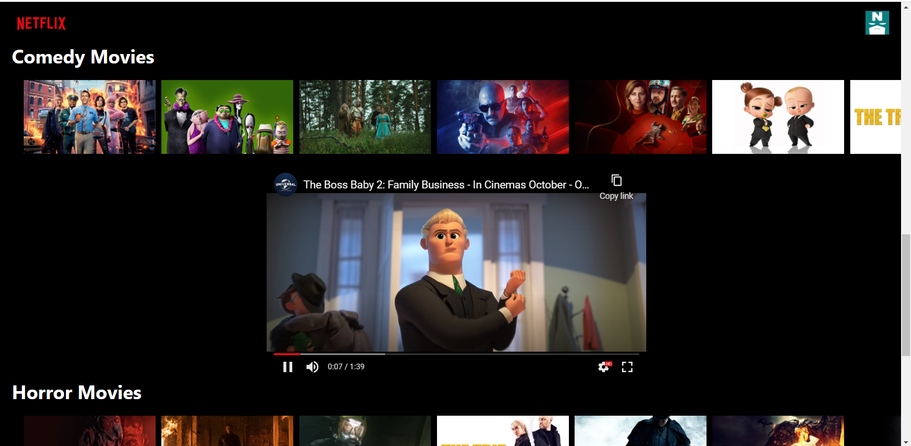

# Getting Started with Create React App

This project was bootstrapped with [Create React App](https://github.com/facebook/create-react-app).

### `npm install`

It install all the dependancies present in the package.json file.

### `npm start`

Runs the app in the development mode.\
Open [http://localhost:3000](http://localhost:3000) to view it in the browser.

The page will reload if you make edits.\
You will also see any lint errors in the console.

 

### `Key features`

 

1.Home Page-

 

2.Movies fetched via API

 

3.Play trailer when movie is clicked

